## generated-videos

Samples of videos generated from 6 experiments. The 6th and final experiment is named Vid2Pix. All videos contain 10 generated frames.

#### Experiment 1
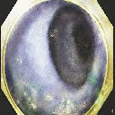 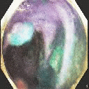 

#### Experiment 2
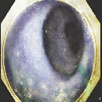 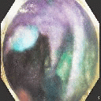 

#### Experiment 3
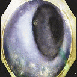  

#### Experiment 4
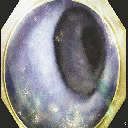 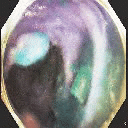 

#### Experiment 5
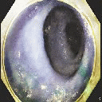 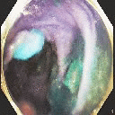 

#### Experiment 6
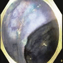 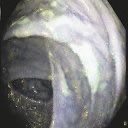 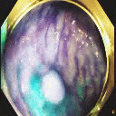 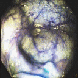

#### Experiment 7
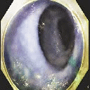 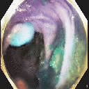 
