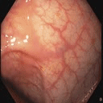

## generated-videos

Samples of videos generated from 9 model experiments. The final model is experiment: "2D output" named Vid2Pix. All videos contain 4 generated frames. All model experiments besides the last, have been trained using early stopping.

#### Original Pix2Pix
    

#### Replace with 3D layers
    

#### Change filter size
    

#### Offset Downsampling
    

#### Reduce discriminator complexity
    

#### Keep more features
    

#### Add noise
    

#### 2D output Vid2Pix
    

#### 2D output 1000 epochs
    
